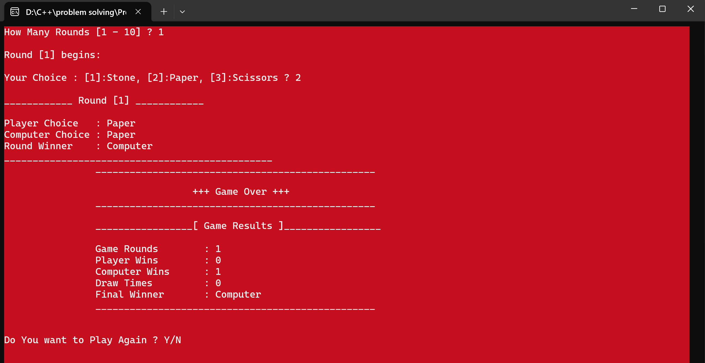
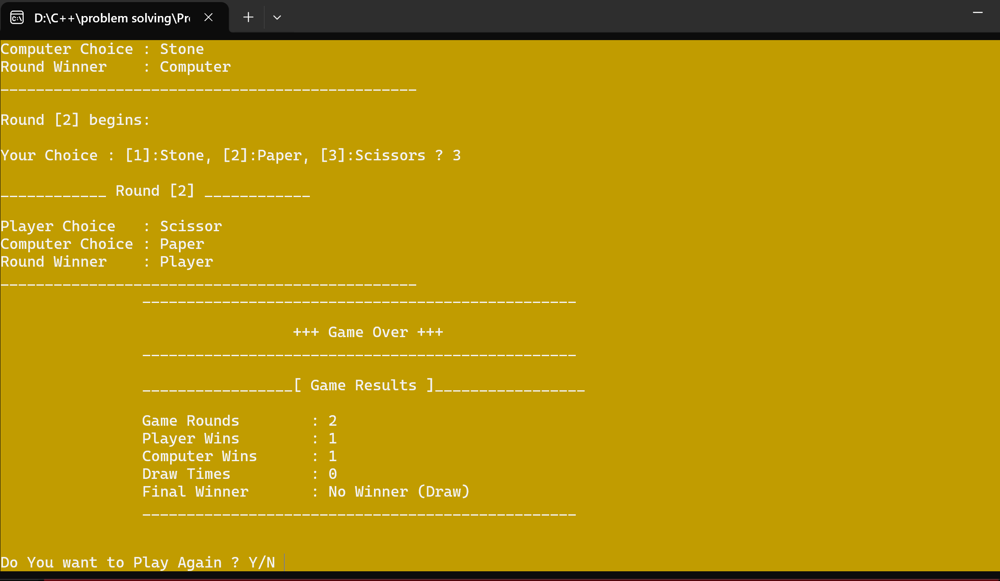

# 🏆 Stein – Papier – Schere (Rock-Paper-Scissors) C++ Game 🎮

Ein einfaches Konsolen-Spiel in **C++**, das grundlegende Programmierkonzepte demonstriert und **Logik, Struktur sowie sauberen Code** zeigt.

---

## **1️⃣ Ziel des Projekts**

Dieses Konsolenprojekt zeigt **Logik, Struktur und sauberen Code**.  
Der Spieler kann zwischen **Stein, Papier oder Schere** wählen, der Computer wählt **zufällig**, und das Spiel bestimmt den Gewinner jeder Runde.  
Am Ende wird der **Gesamtsieger** angezeigt.

---

## **2️⃣ Projektbeschreibung**

- Spieler wählt **Stein, Papier oder Schere**  
- Computer wählt **zufällig** zwischen Stein, Papier oder Schere  
- Das Spiel **bestimmt den Gewinner** jeder Runde  
- Am Ende werden alle Runden zusammengefasst  
- Spieler kann entscheiden, **das Spiel erneut zu starten**

---

## **3️⃣ Funktionsübersicht / Funktionen**

| Funktion | Zweck |
| --- | --- |
| `RandomNumber(int From, int To)` | Zufallszahl zwischen From und To |
| `Tabs(short NumberOfTabs)` | Erzeugt Tabs zur Bildschirmformatierung |
| `GetComputerChoice()` | Zufällige Wahl des Computers |
| `ReadPlayerChoice()` | Spielerwahl einlesen und prüfen |
| `ChoiceName(enGameChoice Choice)` | Gibt Name der Wahl zurück |
| `WhoWinTheRound(stRoundInfo RoundInfo)` | Gewinner der Runde bestimmen |
| `WhoWinTheGame(short PlayerWins, short ComputerWins)` | Gesamtsieger bestimmen |
| `PrintRoundResults(stRoundInfo RoundInfo)` | Zeigt Runden-Ergebnisse |
| `ShowFinalGameResults(stGameResult GameResults)` | Zeigt Endergebnis |
| `PlayGame(short HowManyRounds)` | Spielrunden ablaufen lassen |

---

## **4️⃣ Code-Beispiel**

```cpp
#include <iostream>
#include <cstdlib>
#include <ctime>
using namespace std;

enum enGameChoice { Stone=1, Paper=2, Scissor=3 };
enum enWinner { Player=1, Computer=2, Draw=3 };

// Dies ist nur ein Ausschnitt des Codes.
// Den vollständigen Code finden Sie in der Datei `Stein-Papier-Schere.cpp`.

## **5️⃣ Spielausgabe / Screenshots**

🎮 Screenshot zeigt die Ergebnisse des Spiels „Stein – Papier – Schere“

- Spielerwahl, Computerwahl und Gewinner jeder Runde
- Endergebnis nach allen gespielten Runden
- Veranschaulicht die Logik und Funktionsweise des Programms





---

## **6️⃣ Herausforderungen & Skills**

✅ Effiziente Implementierung der Spiel-Logik  
✅ Verwendung von Enums und Structs  
✅ Zufällige Computerentscheidungen mit rand()  
✅ Dynamische Verwaltung von Rundenergebnissen  
✅ Korrekte Berechnung des Gesamtsiegers  
✅ Saubere Funktionen, Wiederverwendbarkeit, klare Variablennamen

---

## **7️⃣ Fazit**

Dieses Projekt demonstriert die grundlegenden Fähigkeiten in C++ und zeigt:

- Strukturierte Programmierung  
- Modulare Logik  
- Gutes Coding-Praktiken 💻✨
